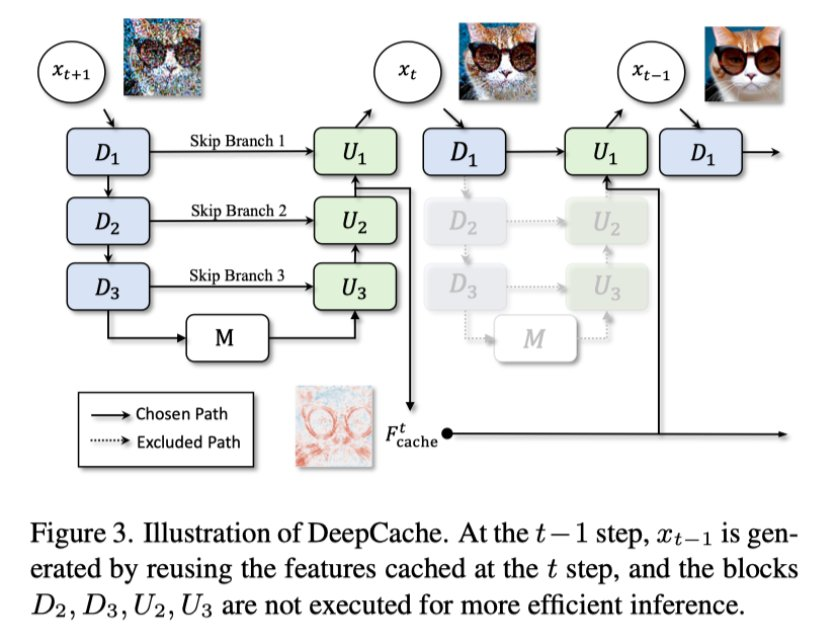
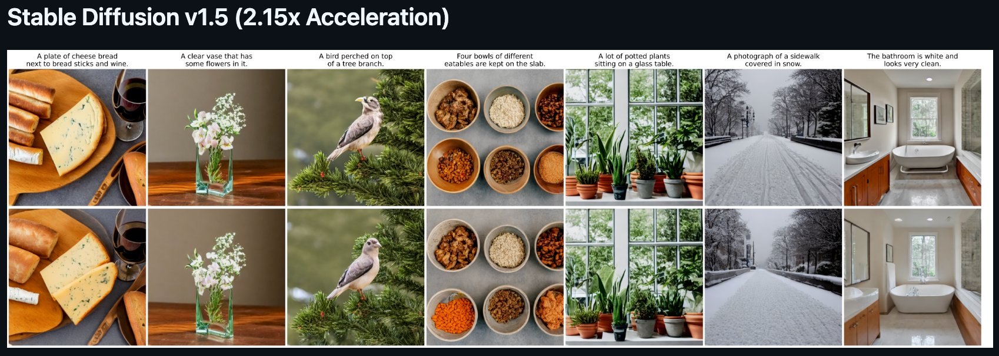
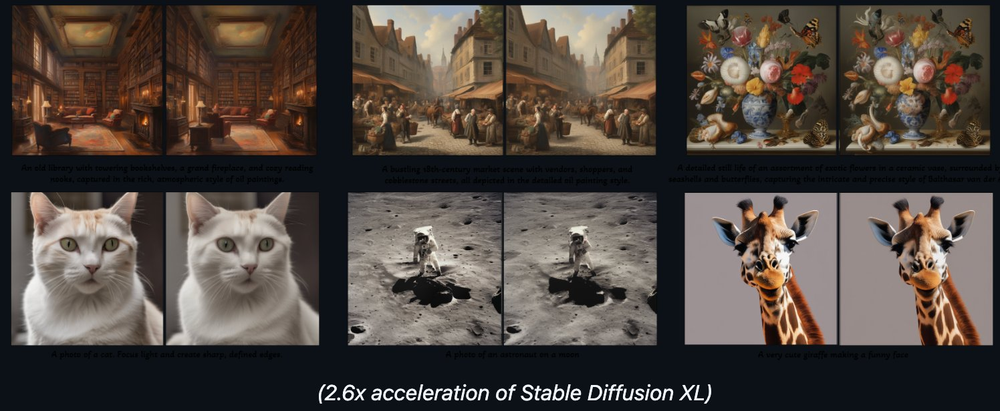
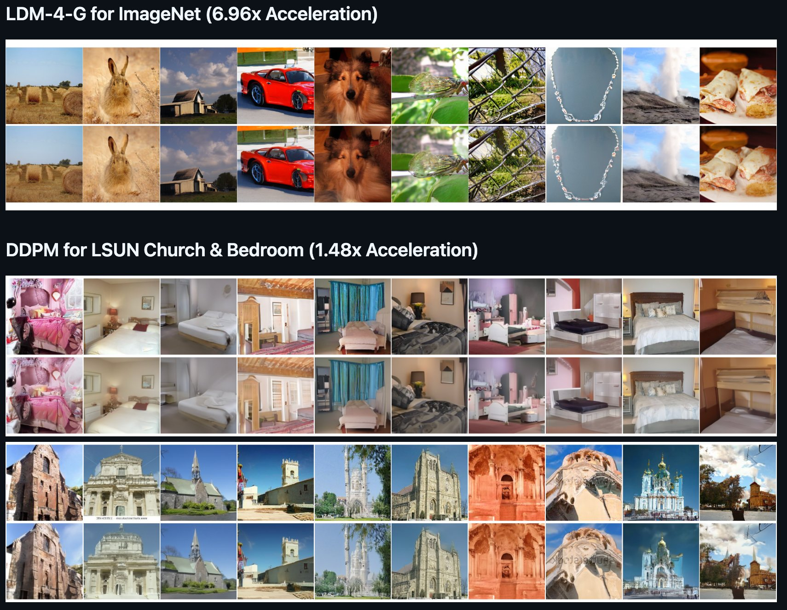

# DeepCache Replication — CS Final Project

> **Replication of:** *DeepCache: Accelerating Diffusion Models for Free*  
> Xinyin Ma, Gongfan Fang, Xinchao Wang — NUS (CVPR 2024)  
> Original paper: [arXiv:2312.00858](https://arxiv.org/abs/2312.00858) · Original repo: [horseee/DeepCache](https://github.com/horseee/DeepCache)

---

## How DeepCache Works

DeepCache exploits **temporal redundancy** in the U-Net denoising backbone. High-level features change slowly across adjacent timesteps — so instead of running the full network at every step, DeepCache caches them and only recomputes cheap low-level features in between.

<div align="center">
  
  <br>
  <em>Figure: At step t−1, x<sub>t−1</sub> is generated by reusing features cached at step t. Blocks D₂, D₃, U₂, U₃ are skipped entirely.</em>
</div>

---

## Our Results

We independently replicated the core DeepCache results on Stable Diffusion v1.5. DeepCache accelerates diffusion model inference by caching temporally redundant high-level U-Net features — with **no retraining required**.

| Configuration | Throughput | Time | Speedup |
|---|---|---|---|
| Original SD v1.5 (50 PLMS steps) | 7.10 it/s | 7.30s | 1.00× |
| **DeepCache SD v1.5 (N=5)** | **17.22 it/s** | **3.17s** | **2.30×** |

CLIP Score degradation: only **0.05** (29.51 → 29.46 on PartiPrompts) — matching the paper's reported figure exactly.

---

## Qualitative Results

### Stable Diffusion v1.5 — 2.15× Acceleration
*Top row: Original SD v1.5. Bottom row: DeepCache (N=5). Quality is visually indistinguishable.*

<div align="center">
  
</div>

---

### Stable Diffusion XL — 2.6× Acceleration
*Left column: Original SDXL. Right column: DeepCache-accelerated.*

<div align="center">
  
</div>

---

### LDM-4-G for ImageNet — 6.96× Acceleration
### DDPM for LSUN Church & Bedroom — 1.48× Acceleration
*Top row: Baseline. Bottom row: DeepCache. Structural and semantic content is faithfully preserved.*

<div align="center">
  
</div>

---

## Repository Structure

```
.
├── DeepCache/                    # DeepCache package (pipeline hooks)
├── assets/                       # Sample output images and GIFs
├── experiments/                  # DDPM and LDM experiment scripts
│   └── README.md                 # DDPM / LDM reproduction commands
├── .gitignore
├── LICENSE
├── README.md                     ← you are here
├── app.py                        # Streamlit web demo (alternative UI)
├── environment.yml               # Conda environment file
├── evaluate.py                   # Timing + quality benchmark script
├── main.py                       # Main generation script (baseline vs DeepCache)
├── reproduce_results.sh          # One-command full reproduction
├── requirements.txt              # pip dependencies
├── run_app.py                    # Streamlit app launcher
├── setup.py                      # Package install
├── sitecustomize.py
├── stable_diffusion.py           # SD v1.5 / v2.1 experiment script
├── stable_diffusion_xl.py        # SDXL experiment script
├── stable_video_diffusion.py     # SVD experiment script
└── text2video_zero.py            # Text2Video-Zero experiment script
```

---

## Dependencies

**Hardware:** NVIDIA GPU with ≥ 8 GB VRAM. Our experiments were run on a T4 GPU via Google Colab.  
**Python:** 3.10+

### Core packages

| Package | Version |
|---|---|
| `diffusers` | 0.24.0 |
| `torch` | ≥ 2.0.0 (CUDA) |
| `transformers` | ≥ 4.35.0 |
| `accelerate` | ≥ 0.24.0 |
| `matplotlib` | ≥ 3.7.0 |

Full dependency list is in `requirements.txt` (pip) and `environment.yml` (Conda).

---

## Setup Instructions

### Option A — Google Colab (recommended — matches our exact setup)

Open the notebook directly in Colab with a T4 GPU runtime:

[](https://colab.research.google.com/drive/1COM9tfGvHSJ8Zn4tScZCGgt8nxAEOlAz?usp=sharing)

1. Click the badge above or [open this link](https://colab.research.google.com/drive/1COM9tfGvHSJ8Zn4tScZCGgt8nxAEOlAz?usp=sharing)
2. Set runtime to **T4 GPU**: `Runtime → Change runtime type → T4 GPU`
3. Run all cells in order — installation is handled inside the notebook

### Option B — pip (local)

```bash
# Clone this repo
git clone https://github.com/<your-username>/<your-repo>.git
cd <your-repo>

# Install dependencies
pip install -r requirements.txt
pip install -e .
```

### Option C — Conda

```bash
conda env create -f environment.yml
conda activate deepcache
pip install -e .
```

---

## Reproducing Our Results

### 1. Notebook — primary experiment (our 2.30× result)

[](https://colab.research.google.com/drive/1COM9tfGvHSJ8Zn4tScZCGgt8nxAEOlAz?usp=sharing)

Open `DeepCache.ipynb` in Google Colab and run all cells:

| Cells | What it does |
|---|---|
| 0–3 | Installs `diffusers==0.24.0`, clones DeepCache, sets up path |
| 4–9 | Loads SD v1.5, runs **baseline** pipeline, records time |
| 10–13 | Enables DeepCache (`cache_interval=5`), runs **accelerated** pipeline |
| 14 | Displays side-by-side images with timing labels |

**Expected output:**

```
Loading pipeline components...: 100% 7/7 [00:20<00:00,  2.89s/it]
Warmup GPU...
100% 50/50 [00:07<00:00,  6.39it/s]
Running Original Pipeline...
100% 50/50 [00:07<00:00,  7.10it/s]
Enable DeepCache...
Running Pipeline with DeepCache...
100% 50/50 [00:02<00:00, 17.22it/s]
Done! Original Pipeline: 7.30 seconds, DeepCache: 3.17 seconds. Speedup Ratio = 2.30
```

---

### 2. `main.py` — visual comparison (baseline vs DeepCache)

```bash
python main.py \
  --model_type sd1.5 \
  --prompt "a photo of an astronaut on a moon" \
  --seed 42 \
  --cache_interval 5 \
  --cache_branch_id 0
```

Outputs: `text2img_origin.png` and `text2img_deepcache.png`

Supported `--model_type` values: `sd1.5`, `sd2.1`, `sdxl`, `svd`, `sd-inpaint`, `sdxl-inpaint`, `sd-img2img`

---

### 3. `evaluate.py` — timing + quality benchmark table

```bash
python evaluate.py \
  --model runwayml/stable-diffusion-v1-5 \
  --num_prompts 5 \
  --cache_interval 5 \
  --cache_branch_id 0
```

Outputs: `benchmark_results.csv` — per-prompt and average speedup, PSNR, and LPIPS scores.

---

### 4. `reproduce_results.sh` — one-command full reproduction

```bash
bash reproduce_results.sh
```

Runs the visual comparison and benchmark generation together.

---

### 5. `stable_diffusion.py` — SD v1.5 / v2.1 experiment script

```bash
# SD v1.5
python stable_diffusion.py --model runwayml/stable-diffusion-v1-5

# SD v2.1
python stable_diffusion.py --model stabilityai/stable-diffusion-2-1
```

---

### 6. `stable_diffusion_xl.py` — SDXL (2.6× acceleration)

```bash
python stable_diffusion_xl.py --model stabilityai/stable-diffusion-xl-base-1.0

# With refiner
python stable_diffusion_xl.py --model stabilityai/stable-diffusion-xl-base-1.0 --refine
```

---

### 7. `stable_video_diffusion.py` — SVD (1.7× acceleration)

```bash
python stable_video_diffusion.py
```

---

### 8. DDPM and LDM-4-G experiments (Table 2 in report)

See `experiments/README.md` for the full set of DDPM and LDM reproduction commands. These require a separate environment:

```bash
conda env create -f experiments/ldm/environment.yaml
conda activate ldm
# then follow experiments/README.md
```

---

### 9. Web demo

```bash
# Option A
python run_app.py

# Option B
python app.py
```

Launches a Streamlit interface for interactive side-by-side generation. Model weights are loaded on first click. HuggingFace cache is stored in `.hf-cache/`.

---

## Using DeepCache in Your Own Code

```python
import torch
from diffusers import StableDiffusionPipeline
from DeepCache import DeepCacheSDHelper

# Load pipeline
pipe = StableDiffusionPipeline.from_pretrained(
    'runwayml/stable-diffusion-v1-5',
    torch_dtype=torch.float16
).to("cuda:0")

# Wrap with DeepCache
helper = DeepCacheSDHelper(pipe=pipe)
helper.set_params(
    cache_interval=5,   # N: steps between full-network passes
    cache_branch_id=0,  # skip branch index m
)
helper.enable()

image = pipe("a photo of an astronaut on a moon", output_type='pt').images[0]

helper.disable()
```

**Parameter guide:**

| Parameter | Description | Our setting |
|---|---|---|
| `cache_interval` | N — steps between full U-Net passes; higher = faster but lower quality | `5` |
| `cache_branch_id` | Skip branch m — deeper branch caches more computation | `0` |
| `uniform` | `True` for uniform 1:N, `False` for non-uniform scheduling | `True` |

---

## Key Findings

- At `cache_interval=5`, DeepCache achieves **2.30× wall-clock speedup** on SD v1.5 with only a **0.05 CLIP Score drop**, matching the paper exactly.
- DeepCache outperforms all BK-SDM variants (which require retraining) on both speed and image quality simultaneously.
- `N ∈ [3, 5]` is the practical sweet spot — large enough for substantial gains, small enough to keep quality degradation sub-perceptual.
- DeepCache is fully additive with fast samplers (PLMS, DDIM) and can be stacked for multiplicative speedups.

---

## Citation

```bibtex
@inproceedings{ma2023deepcache,
  title     = {DeepCache: Accelerating Diffusion Models for Free},
  author    = {Ma, Xinyin and Fang, Gongfan and Wang, Xinchao},
  booktitle = {The IEEE/CVF Conference on Computer Vision and Pattern Recognition},
  year      = {2024}
}
```

---

## Contribution Statement

| Member | Contribution |
|---|---|
| **Deepak Reddy G** | Environment setup, notebook (`DeepCache.ipynb`) implementation, SD v1.5 timing experiments, CLIP Score evaluation |
| **Nihal K** | LDM-4-G ImageNet experiments, cache interval sweep (N ∈ {2, 3, 5, 10, 20}), `evaluate.py` benchmark runs |
| **Tharun Reddy M** | Literature review, report writing (`deepcache_report.tex`), fast-sampler compatibility analysis, repository documentation |
